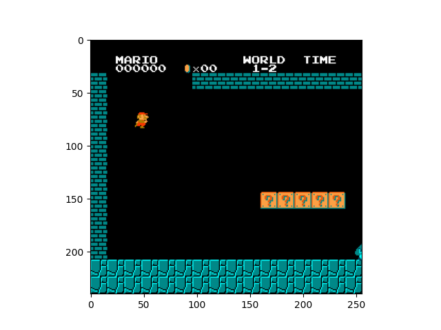
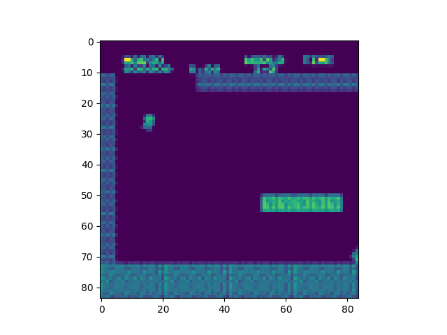
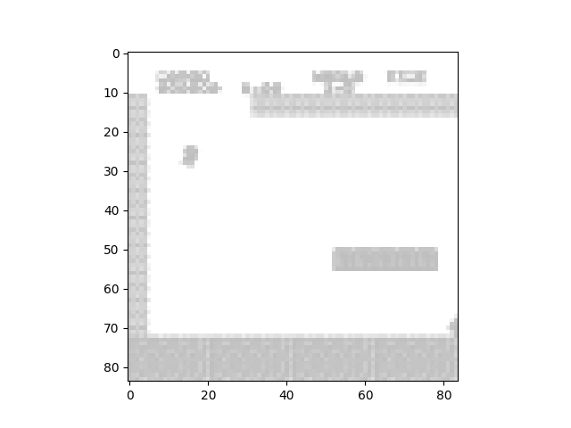

In reinforcement learning, data gathering is done by the agent interacting with its environment. In this case that is done by Mario interacting with Level 1-2 in Super Mario Bros. The data gathering is continuously done as the agent collects experiences. The agent collects experiences by recording a snapshot of the interaction between the action taken by Mario, the resulting state of the game, and the reward obtained. 

The nature of the dataset captured through the experiences is sequential. Mario, and video games in general, are temporally dependent. So, the actions of the agent must be recorded and organized. This was done using a replay buffer, which allowed the model to store the experiences for later use in training.
Data cleaning was not needed in this context. Even low-scoring runs can be beneficial to the model by discouraging the agent from taking those actions in later runs.

Label preparation was also not exactly needed in this project. Labels in Q-learning are created by calculating the target Q-values for the network. The labels are derived from the rewards obtained by the agent and the estimated future rewards predicted by the network. Q-values normally represent the expected total rewards predicted for taking a specific action in the given game state. 

The most important part of the data gathering was actually preparing the data. Since my Mario model does not interact with the game memory, it was important to preprocess the game frame so that model can interact with the game properly. The following wrapper was used to prepare an OpenAI gym environment for the agent to use.

```
def wrap_nes(env_id, action_space):
    """
    Configure environment for NES.


    :param env_id: (str) the environment ID
    :param action_space: (list) action space
    :return: (Gym Environment) the wrapped environment
    """
    env = gym.make(env_id)
    # env = retro.RetroEnv(game =env_id)
    env = JoypadSpace(env, action_space)
    env = MaxAndSkipEnv(env)
    if 'FIRE' in env.unwrapped.get_action_meanings():
        env = FireResetEnv(env)
    env = FrameDownSample(env)
    env = ScaledFloatFrame(env)
    env = LazyFrameStack(env, 4)
    env = CustomReward(env)
    return env

```
Breaking this wrapper down, the line `gym.make(env_id)` builds the base Gym environment for the specified Mario level. `JoypadSpace` wrapper modifies the action space of the environment. This was done to decrease the actions available to the agent and to prevent the agent from taking actions that do not result in an action. The `MaxAndSkipEnv` wrapper modifies the environment to repeat the same action for 4 frames. This helps the agent be patient and not try inputting multiple times during a long action where Mario cannot do anything, like being in the air during a jump. The `FireResetEnv` simulates pressing the "Fire" button at the start of each episode, which is required in most NES games. The `FrameDownSample` wrapper is applied to downsample the resolution of the game frame. This helps with computational load as well as helping the model itself. Since we don't need every pixel in the game frame, it is alright to downsample. The `ScaledFloatFrame` scales the pixel values to floating point values between 0 and 1. Finally, the `CustomReward` wrapper allows the model to use a custom reward. The gym environment often has its own reward functions, but a custom reward function was made to fit the Mario environment.

Using these wrappers, the frames from the Mario game were effectively processed before the game even started. This allowed the game to run smoothly and the agent to optimally interact with the environment.Shown below are the results of the wrappers.

 

*A normal frame of Mario*



*A frame of Mario after downsampling*



*A frame of Mario after all wrappers have been applied*

