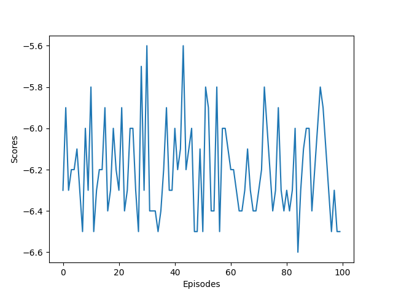

 NEED TO ADD IMAGES OF PREPROCESSING TO DATA PAGE

 At the start of training this model, the Mario agent did a poor job of passing the level. It would often jump into enemies and not progress very far. Shown below is a clip of the Mario agent at the start of training.

<video width="320" height="240" controls>
  <source src="assets/vd/mario_bad.mp4" type="video/mp4">
</video>
 
 
 After training my model for 4433 episodes, taking around 100 hours, my model has exceeded my expectations. It is able to reliably progress through the level, sometimes even reaching the flag. It has some trouble after entering the green pipe at the end of the level, but I attribute that to the level layout changing and likely some changes with Mario's position in the backend. Shown below is one of the best runs. 

 ## run goes here

 This run took xxx seconds, which when compared to the Speedrun leaderboards, would place me at xxx place.
 As predicted, the model continuously progressed and improved its scores. Shown below is a graph of Total Rewards over time. Unfortunately, the graph does not cover all 4433 episodes of training, since I had to manually stop the training since it began taking so long and was not going to reach the final goal of 50000 episodes.

*A graph of rewards over 100 episodes for an untrained model*

 After training this model, I wanted to see how it would fair on other Super Mario Bros. levels. Shown below is a highlight reel of this model playing various levels from Super Mario Bros.

 ## this goes here

All the code for this model is located at **link**. Additionally, the saved best model is included within the Github Repository.

